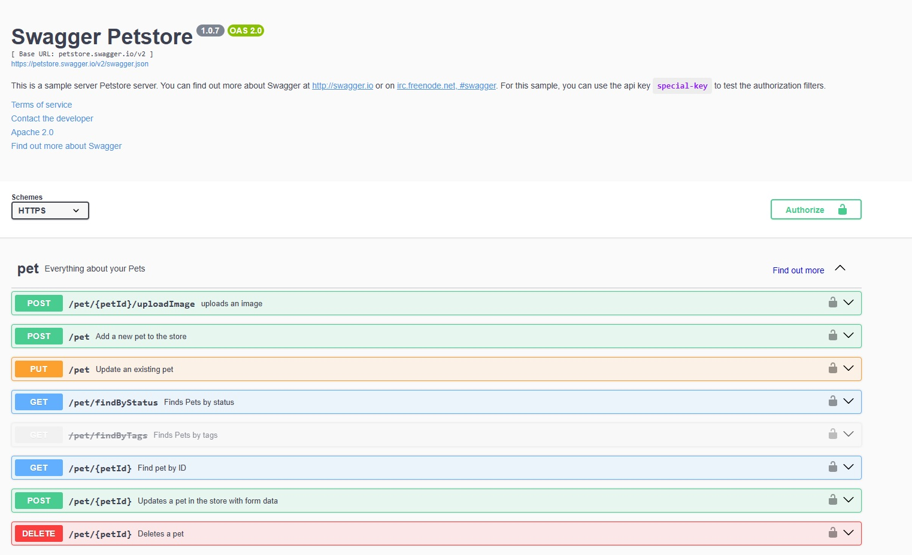
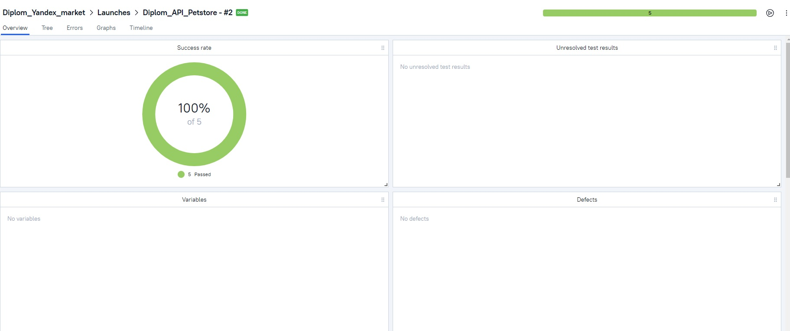
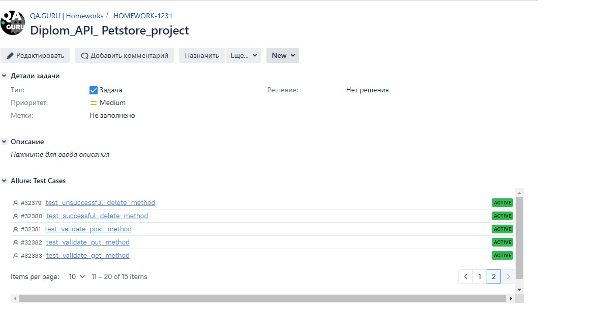
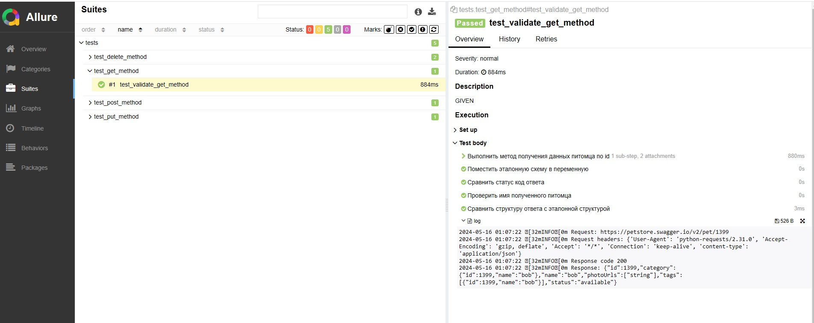

# Проект по автоматизации тестирования API Petstore

> <a target="_blank" href="https://petstore.swagger.io/#/">Ссылка на сайт</a>



*** 

### Проект реализован на стеке

       

***  

### Особенности проекта

* В тестах проверяются request body, response body, status code
* Логирования уровня, даты и времени запуска, request body, response body, status code
* Сборка проекта в Jenkins
* Отчеты Allure Report
* Интеграция с Allure TestOps
* Автоматизация отчетности о тестовых прогонах и тест-кейсах в Jira

----

### Реализованные проеверки

1. Добавление нового питомца (post)
2. Получение данных о питомце (get)
3. Изменение данных питомца (put)
4. Удаление несуществующего питомца (delete)
5. Удаление существующего питомца (delete)

____

### [Проект](https://jenkins.autotests.cloud/job/Diplom_API_Petstore/) в Jenkins

### Локальный запуск

**Для локального запуска необходимо выполнить:**

```bash
python -m venv .venv
source .venv/bin/activate
pip install -r requirements.txt
pytest -s -v
```

____
**Для получения отчета:**

```bash
allure serve build/allure-results
```

____

1. **Allure testops** 

   

___  

2. **Jira**  
   

___  

3. **Allure reports** 

   
